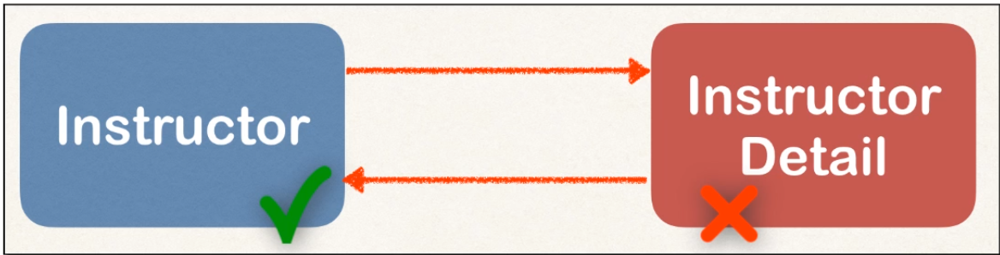

# :fallen_leaf: :leaves: Hibernate - One to One - CRUD - MySQL :leaves: :fallen_leaf:

## One To One Classes

This project was done using these classes in the image. 

In this project you can find two examples of classes. One of them is Bi-Directional and the other one is about Bi-Directional deleting a person.

## You can see Bi-Directional example

  

## When you delete a person from the Instructor class which is not going to affect the Instructor Detail class. In below:

  
 
